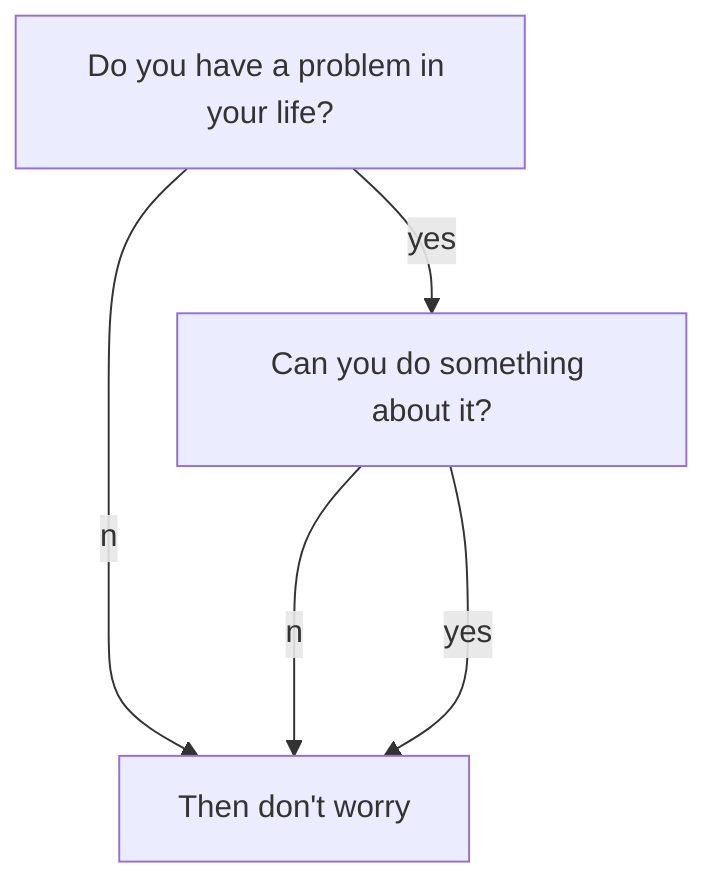

mermaid: true
---
```

## 使用教程  
各项图标的教程，已经在[此处](https://www.chartjs.org/docs/latest/charts/)查看  
下面只是示例与展示  
  
## 示例与展示  
```
	```mermaid
graph TB;
    A[Do you have a problem in your life?]
    B[Then don't worry]
    C[Can you do something about it?]
    A--no-->B;
    A--yes-->C;
    C--no-->B;
    C--yes-->B;
	```
```

  
---
  
```
	```mermaid
graph TD;
    A-->B;
    A-->C;
    B-->D;
    C-->D;
	```
```
  
