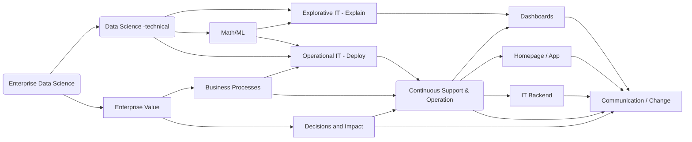

**注！**
该页面本为项目专项介绍之所，现为网页教学，如学成，删去`/docs/_docs/*`下所有文档即可。或不删自行修改与配置。  
如若删去，可上我的[备份站](https://eroskss.github.io/)，能做删后参考。
{:.error}
  
## 板块一·网站首页  
  
网站首页是用来做什么的呢？  
网站首页是一项“总的导航”，它的功效在于为不熟悉网站布局的人寻得网站的`重心与焦点`，并为他指向作者想要让他看见的东西。比如往下拉的“项目过程”“项目环节”“团队介绍”与“支持与转发”等。
> **如何修改网站的首页？**  
  
```
- landing.html
```
首页的配置很简单，它的配置文件在整个网站文件中只有`/landing.html`一项而已。  
而首页的`文字修改`、`图片替换`、`超链接更替`，都可在`/landing.html`文件中完成。  
  
下面是一项示例，节选于`/landing.html`,我將为所有的节选代码都标上注释【注释为##后面的东西】：    
```markdown
---
layout: landing ## layout为【该页面是什么布局？】，landing回【为登陆起始页面】
title: 创青春项目 ## 首页标题
excerpt: > ## 副标题，下面写内容 【注意所有文件的缩进与空格，不然会报错】
  主办单位：共青团中央、教育部、人力资源和社会保障部、中国科协、全国学联
permalink: /index.html ## 首页的链接为/index.html

article_header:  ## 文章标头
  actions:  ## 各个路径
    - text: 项目介绍  ##标头里的文字
      type: error  ##标头样式为error，也就是红色
      url: /docs/What_is_on_the_page ##该标头指向的链接路径
    - text: 项目文档  ##标头里的文字
      type: outline-theme-dark ##标头样式为outline-theme-dar
      url: /docs/ ##该标头指向的链接路径
  height: 100vh  ##标头高度
  theme: dark  ##标头主题为dark
  background_color: "#367a9a" ##标头背景色为"#367a9a"
  background_image: ##标头图片
    gradient: "linear-gradient(rgba(0, 0, 0, .2), rgba(0, 0, 0, .6))" ##标头线性梯度，不用管
    src: /docs/assets/images/cover4.jpg ##标头图片路径
data:  ##文字部分信息
  sections:
    - title: 这是介绍项目的海报位置  ##主标题
      excerpt: 网站同时也适配电脑与手机  ##副标题
      theme: dark  ##主题
      image:  ## 下面是图片路径地址和背景色
        src: /screenshots/TeXt-responsive.png
      background_color: "#515151"
---
```


<!--more-->
#### High level enterprise data science flow graph

The graph gives only a very high level abstraction of enterprise data science. Note, that many lectures are focusing on the top (technical) data science part. Which is important especially to train mandatory programming / math skill sets, however, the enterprise world is more complicated. The link to business and the impact is vey challenging. In the lecture series we try to address some high level aspects.


