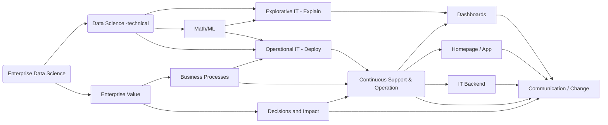

## 网页的五大板块与一项配置

**注！** 该页面本为项目专项介绍之所，现为网页教学，如学成，删去`/docs/_docs/*`下所有文档，或不删自行修改、配置即可。
{:.error}
  
[complementary blog posts](/docs/enterprise_data_science
)

#### used python packages in the lecture

```
- numpy
- pandas
- scikit-learn
- bokeh
- seaborn
- tensorflow
```

<!--more-->
#### High level enterprise data science flow graph

The graph gives only a very high level abstraction of enterprise data science. Note, that many lectures are focusing on the top (technical) data science part. Which is important especially to train mandatory programming / math skill sets, however, the enterprise world is more complicated. The link to business and the impact is vey challenging. In the lecture series we try to address some high level aspects.


